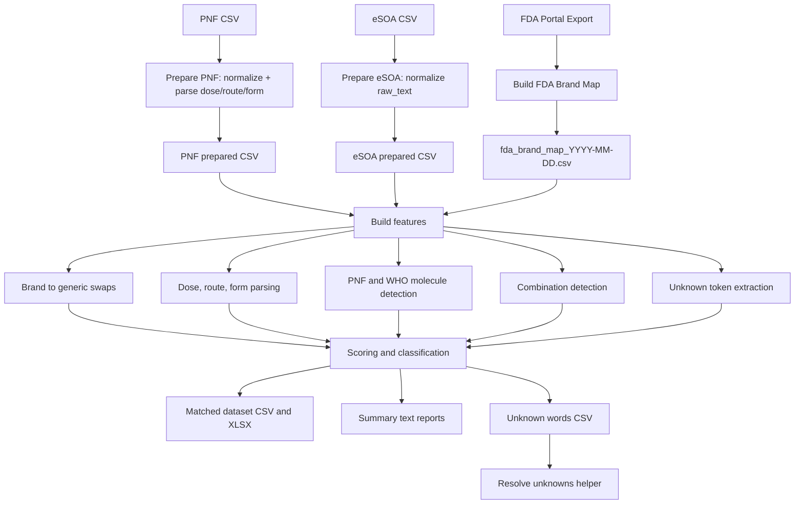

# eSOA Drug Matching Pipeline

This repository implements the **eSOA (electronic Statement of Account) drug matching pipeline**, a dose- and form-aware system that maps free-text medicine descriptions from hospital bills (eSOAs) to standardized drug references:

- **Philippine National Formulary (PNF)**
- **FDA brand map** (brand → generic links from FDA PH online export)
- **WHO ATC classification** (international codes)

It prepares raw CSVs, parses text into structured features, detects candidate generics, scores/classifies matches, and outputs a labeled dataset with a detailed distribution summary and unknown token report. The goal is to support **public health operations and oversight**, not commercial decision-making.

## Requirements

- `pip install -r requirements.txt`

**Python packages**
- `numpy>=1.21`
- `openpyxl>=3.1`
- `pandas>=1.5`
- `pyahocorasick>=2.0`
- `requests>=2.31`
- `XlsxWriter>=3.0`

**R packages for WHO ATC preprocessing**
- `pacman`
- `rvest`
- `dplyr`
- `readr`
- `xml2`
- `purrr`
- `future`
- `furrr`
- `memoise`
- `httr2`
- `tibble`
- `stringr`

---

## 🚀 Pipeline Overview

### Flowchart



---

## 🧠 Core Algorithmic Logic

1. Dose Parsing ([scripts/dose.py](https://github.com/carlosresu/esoa/blob/main/scripts/dose.py))

Understands expressions like:

- Amounts: 500 mg, 250 mcg, 1 g
- Ratios: 5 mg/5 mL, 1 g/100 mL, x mg per spray
- Packs: 10 × 500 mg (unmasks to 500 mg, not 5000 mg)
- Percents: 0.9%, optionally w/v or w/w
- Compact unit-dose nouns: mg/tab, mg/cap, mg/spray, mg/puff

Normalization:

- Converts g↦mg, µg/μg↦mcg, L↦1000 mL
- Computes mg per mL for ratio doses when possible
- Dose alignment (dose_sim):

  - Returns 1.0 only when the eSOA dose equals the PNF payload exactly after unit conversion. Anything else scores 0.0, keeping auto-accepts precise.
  - Ratio doses require the same mg/mL (or equivalent) and percent strengths must match exactly.
  - Special equivalence: modified-release trimetazidine capsules (55–90 mg) are still accepted against the 35 mg base strength in the PNF.

Public health/program implications  
Exact matching maximizes precision but increases manual review load when facilities document rounded strengths. Program choices determine whether more therapeutic equivalence rules should be added.

Supervisor input needed

- Should we introduce configurable tolerances or extend `_SPECIAL_AMOUNT_EQUIVALENCE` to other molecules with consistent packaging differences?
- For which clinical areas (e.g., pediatric dilutions) would a near-match rule still be acceptable without compromising safety?

---

2. Route & Form Detection ([scripts/routes_forms.py](https://github.com/carlosresu/esoa/blob/main/scripts/routes_forms.py) + [scripts/match_scoring.py](https://github.com/carlosresu/esoa/blob/main/scripts/match_scoring.py))

- Recognizes forms (tablet, cap, MDI, DPI, susp, soln, spray, supp, etc.) and maps them to canonical routes (oral, inhalation, nasal, rectal, etc.), expanding common aliases (PO, per os, SL, IM, IV, etc.).
- When an eSOA entry is missing the route but the form is present, the PNF-derived route is imputed and logged in `route_evidence`. If only WHO metadata is available, we map WHO Adm.R/UOM codes to the same canonical routes/forms so alignment with PNF logic remains consistent.
- The scorer keeps a per-route interchange whitelist (`APPROVED_ROUTE_FORMS`) so, for example, tablets and capsules under the oral route both satisfy `form_ok`. Accepted substitutions are surfaced in `route_form_imputations`.
- Suspicious but historically observed combinations (e.g., oral vials) live in `FLAGGED_ROUTE_FORM_EXCEPTIONS`; they remain valid yet receive a `flagged:` annotation so reviewers know why the match passed.
- Solid oral forms are not auto-imputed when the detected dose is a ratio (mg/mL) to avoid creating impossible solid/liquid pairings.

Public health/program implications  
This policy controls where the system treats forms as interchangeable. Expanding the whitelist reduces manual review but risks masking clinically important distinctions (e.g., sachet vs suspension).

Supervisor input needed

- Does the current `APPROVED_ROUTE_FORMS` mapping reflect program policy—for instance, should syrups, suspensions, and sachets all count as interchangeable oral forms?
- Are there additional flagged route/form exceptions that should always require human review, or conversely, any that can be safely promoted into the approved list?

---

3. Brand → Generic Swap ([scripts/brand_map.py](https://github.com/carlosresu/esoa/blob/main/scripts/brand_map.py), used in [scripts/match_features.py](https://github.com/carlosresu/esoa/blob/main/scripts/match_features.py))

- Builds Aho–Corasick automata of FDA brand names; maps each to one or more FDA-listed generics with optional dose/form metadata.
- For each eSOA line, we detect brands in the main text and replace with the FDA generic, recording did_brand_swap = True.
- We do not swap text inside parentheses — assumption: parentheses annotate brands when the generic already leads (e.g., paracetamol (Biogesic)).

Public health/program implications  
Brand→generic swaps substantially increase coverage/standardization but can hide dose/form discrepancies when brand packaging differs.

Supervisor input needed

- If a brand maps to multiple generics or variants, should we:
  - prefer PNF-present generics,
  - prioritize dose/form corroboration, or
  - always select the longest/most specific generic token?

---

4. Combination vs. Salt Detection ([scripts/combos.py](https://github.com/carlosresu/esoa/blob/main/scripts/combos.py))

- Splits on +, /, with, but masks dose ratios (mg/mL) to avoid false positives.
- Treats known salt/ester/hydrate tails (e.g., hydrochloride, hemisuccinate, palmitate, pamoate, decanoate) as formulation modifiers and not separate molecules.
- Identifies likely combinations when two or more known generic tokens are present (PNF, WHO, or FDA-generic sets).

Public health/program implications  
Impacts whether a line is processed as a single molecule or combination product.

Supervisor input needed

- Confirm policy: should certain esters/salts be treated as distinct actives in surveillance, or as the same base molecule?

---

5. Best-Variant Selection & Scoring ([scripts/match_scoring.py](https://github.com/carlosresu/esoa/blob/main/scripts/match_scoring.py))

For each eSOA entry with at least one PNF candidate:

- Filters out PNF variants whose `route_allowed` does not contain the detected route.
- Recomputes `dose_sim` against the selected PNF row (exact equality as described above) and prefers liquid formulations when the source dose is a ratio.
- Normalizes route/form pairs against the `APPROVED_ROUTE_FORMS` whitelist, marking accepted substitutions or flagged exceptions in `route_form_imputations`.
- Safely imputes missing form/route (`form_source`/`route_source`) from the chosen PNF variant when the text is silent and the inferred form would be coherent.
- Emits `selected_form`, `selected_variant`, detailed dose fields, and `dose_recognized` when the dose matches exactly.
- `match_quality` covers `dose mismatch`, `form mismatch`, `route mismatch`, `route/form_mismatch`, or notes about missing contextual data; unresolved cases fall back to `unspecified`.
- Confidence scoring: +60 generic present, +15 dose parsed, +10 route evidence, +15 ATC, +⌊dose_sim×10⌋, +10 extra when a clean brand swap aligns on dose/form/route.
- Auto-Accept when a PNF generic with ATC is present and both `form_ok` and `route_ok` are true. Dose mismatches therefore become visible through `dose_sim`/`match_quality` (and optional flagged notes) but do not block Auto-Accept.

Public health/program implications  
The acceptance criteria balance reviewer workload against the risk of approving near-but-not-exact matches. Requiring dose equality keeps the column transparent, but the Auto-Accept gate still needs policy oversight.

Supervisor input needed

- Should Auto-Accept additionally require `dose_sim == 1.0`, or remain tolerant provided route/form are aligned?
- Are the confidence-score weights (60/15/10/15/±10 + bonus) appropriate for triaging review queues, or should brand swaps/dose corroboration carry different weight?

---

6. Unknown Handling ([scripts/match_features.py](https://github.com/carlosresu/esoa/blob/main/scripts/match_features.py) → unknown_words.csv)

- Extracts tokens not recognized in PNF/WHO/FDA sets.
- Categorizes:
  - Single - Unknown
  - Multiple - All Unknown
  - Multiple - Some Unknown
- Post-processing via [resolve_unknowns.py](https://github.com/carlosresu/esoa/blob/main/resolve_unknowns.py) scans those tokens against PNF/WHO/FDA catalogues (token n-grams) and writes `missed_generics.csv` with suggested reference hits.

Public health/program implications  
Frequent unknowns may mean missing formulary entries, local shorthand, or data quality issues.

Supervisor input needed

- Confirm triage workflow: which unknowns trigger formulary enrichment vs local mapping vs data cleaning?
- Suggested triage options:
  - Formulary enrichment (e.g., add missing drugs to PNF)
  - Local mapping (e.g., create local aliases or shorthand mappings)
  - Data quality remediation (e.g., fix typos, OCR errors, or inconsistent formats)

---

## 📊 Outputs

- outputs/esoa_matched.csv — Main matched dataset (includes `route_form_imputations`, `dose_sim`, `confidence`, etc.)
- outputs/esoa_matched.xlsx — Filterable Excel view of the same records
- outputs/summary.txt — Default bucket breakdown; `summary_molecule.txt` and `summary_match.txt` provide molecule- and reason-focused pivots
- outputs/unknown_words.csv — Frequency of unmatched tokens (fed into post-processing)
- outputs/missed_generics.csv — Suggestions from [resolve_unknowns.py](https://github.com/carlosresu/esoa/blob/main/resolve_unknowns.py) that map unknown tokens back to PNF/WHO/FDA references (whole or partial n-gram matches)

Key columns to review inside `outputs/esoa_matched.csv` include:

- `molecules_recognized` — the canonical pipe-delimited list of generics the scorer accepts for ATC alignment and downstream matching
- `probable_brands` — FDA brand display names detected before any swap, useful for auditing `did_brand_swap` outcomes

The complete column reference lives in `data_dictionary.md`.

Example summary (values from a historical run; your counts will vary):

Distribution Summary  
Auto-Accept: 17,089 (15.16%)  
 brand→generic swap: 12,255 (10.88%)  
 OK, no changes: 4,834 (4.29%)  
Needs review: 77,305 (68.6%)  
 Needs review: no/poor dose match: 38,942 (34.56%)  
 Needs review: no/poor form match: 23,333 (20.71%)  
 Needs review: no/poor route match: 12 (0.01%)  
 Needs review: no/poor dose/form/route: 5,389 (4.78%)  
Valid Molecule with ATC (WHO/FDA, not in PNF): 9,629 (8.55%)  
Others: 18,295 (16.23%)  
 Unknown: Multiple - All Unknown: 13,760 (12.21%)  
 Unknown: Multiple - Some Unknown: 2,812 (2.5%)  
 Unknown: Single - Unknown: 1,723 (1.53%)

---

## 🛠️ Running the Pipeline

```bash
# Python 3.10+ (R optional for ATC preprocessing)
pip install -r requirements.txt

# Run full pipeline (writes to ./outputs)
python run.py --pnf inputs/pnf.csv --esoa inputs/esoa.csv --out esoa_matched.csv
```

Optional flags

- --skip-install — Skip pip install
- --skip-r — Skip ATC preprocessing
- --skip-brandmap — Reuse existing FDA brand map

### Minimal/local run

For incremental testing without touching external data sources or emitting Excel, use:

```bash
python run_minimal.py --pnf inputs/pnf.csv --esoa inputs/esoa.csv --out esoa_matched.csv
```

This wrapper invokes `run.py` with `--skip-install --skip-r --skip-brandmap` and removes the Excel artifact, leaving only the CSV/summary outputs.

### Profiling the pipeline

To inspect runtime hotspots, execute the profiled wrapper:

```bash
python debug.py --pnf inputs/pnf.csv --esoa inputs/esoa.csv --out esoa_matched.csv
```

`debug.py` mirrors `run.py` but wraps execution with [pyinstrument](https://github.com/joerick/pyinstrument). Profiling reports are saved to `./outputs/pyinstrument_profile_<timestamp>.html` and `.txt`, allowing you to review the call tree in a browser or terminal.

---

## 📂 Repository Structure

- scripts/
- [aho.py](https://github.com/carlosresu/esoa/blob/main/scripts/aho.py) — Aho–Corasick automata for PNF names
- [combos.py](https://github.com/carlosresu/esoa/blob/main/scripts/combos.py) — Combination vs. salt logic
- [dose.py](https://github.com/carlosresu/esoa/blob/main/scripts/dose.py) — Dose parsing & similarity
- [match_features.py](https://github.com/carlosresu/esoa/blob/main/scripts/match_features.py) — Feature engineering (normalization, brand swap, detectors)
- [match_scoring.py](https://github.com/carlosresu/esoa/blob/main/scripts/match_scoring.py) — Variant selection, scoring, classification
- [match_outputs.py](https://github.com/carlosresu/esoa/blob/main/scripts/match_outputs.py) — CSV/Excel writers and summary
- [match.py](https://github.com/carlosresu/esoa/blob/main/scripts/match.py) — Orchestrates matching
- [prepare.py](https://github.com/carlosresu/esoa/blob/main/scripts/prepare.py) — Prepares PNF/eSOA inputs
- [routes_forms.py](https://github.com/carlosresu/esoa/blob/main/scripts/routes_forms.py) — Form→route maps and parsing
- [text_utils.py](https://github.com/carlosresu/esoa/blob/main/scripts/text_utils.py) — Normalization helpers
- [who_molecules.py](https://github.com/carlosresu/esoa/blob/main/scripts/who_molecules.py) — WHO ATC loader/detector
- [fda_ph_drug_scraper.py](https://github.com/carlosresu/esoa/blob/main/scripts/fda_ph_drug_scraper.py) — FDA PH brand map scraper
- [brand_map.py](https://github.com/carlosresu/esoa/blob/main/scripts/brand_map.py) — Brand automata builder
- [main.py](https://github.com/carlosresu/esoa/blob/main/main.py) — API wrapper (prepare, match, run_all)
- [run.py](https://github.com/carlosresu/esoa/blob/main/run.py) — Full pipeline runner with spinner & timing
- [run_minimal.py](https://github.com/carlosresu/esoa/blob/main/run_minimal.py) — Skip installs/R/brand-map rebuild and Excel export for quick reruns
- [debug/master.py](https://github.com/carlosresu/esoa/blob/main/debug/master.py) — All-in-one concatenated script for debugging
- outputs/ — Generated files

---

## 👥 Intended Users

- Program analysts / pharmacists / clinical reviewers — interpret match criteria, validate outputs, guide policy choices
- Data engineers / data scientists — maintain/extend logic, add sources
- Supervisors / public-health leads — provide direction on tolerance, acceptance policy, handling of unknowns

---

## ✅ Summary of Items for Supervisor Input

1. Dose equivalence rules  
   Dose scoring now demands exact equality (aside from explicit overrides such as modified-release trimetazidine). Do we need more equivalence rules for other molecules, or is strict equality still the desired policy?

2. Route/Form interchange list  
   The `APPROVED_ROUTE_FORMS` whitelist defines which forms are interchangeable within a route, and `FLAGGED_ROUTE_FORM_EXCEPTIONS` document tolerated but suspicious pairings. WHO metadata now feeds additional route/form hints when PNF is silent—please confirm the mapping tables align with program expectations and whether more aliases should be added.

3. Auto-Accept gate  
   Auto-Accept currently ignores dose mismatches as long as a PNF+ATC match with aligned route/form is present. Should we tighten this (e.g., require `dose_sim == 1.0`, brand corroboration, or a higher confidence score) to reduce downstream review risk?

4. Salts/esters policy  
   Should certain salt or ester forms (e.g., hydrochloride, hemisuccinate, palmitate) be treated as distinct actives for surveillance, or grouped with the base molecule as the current salt-list logic does? Clarifying this determines how combination detection and aggregation behave.

5. Unknowns triage  
   `unknown_words.csv` plus `missed_generics.csv` flag candidate additions for the PNF/WHO/FDA dictionaries. Which buckets trigger formulary enrichment, local alias mapping, or data-quality remediation, and who owns each follow-up loop?

6. FDA brand map cadence  
   `probable_brands` and brand-swap scoring depend on the freshness of `fda_brand_map_*.csv`. Confirm how often the brand export should be refreshed and who validates multi-generic mappings before they enter production.

---

## 🔒 Data & Operational Notes

- Standardizes drug text for public-health monitoring, auditing, coverage analytics
- Ensure use aligns with data-sharing agreements & privacy protections
- FDA PH data is fetched from public portal’s CSV export; availability may vary

---

## 📚 Documentation

- `data_dictionary.md` — Column-level definitions and provenance for `outputs/esoa_matched.csv`.
- `pipeline.md` — Step-by-step execution walkthrough of the matching pipeline with module references.

These references stay in sync with the current pipeline logic in `scripts/` and can be used by reviewers or developers who need deeper traceability.
